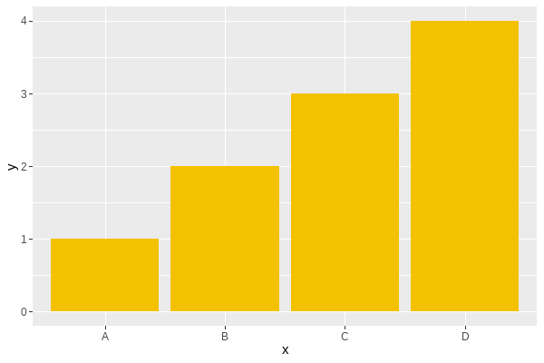
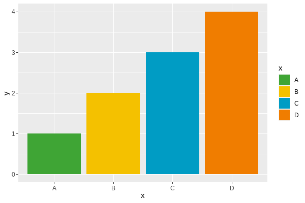
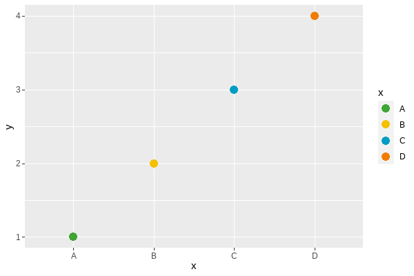
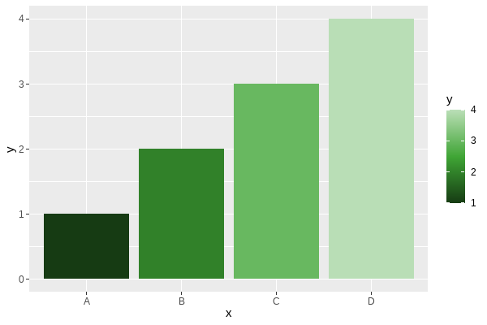
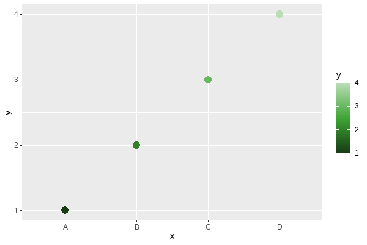
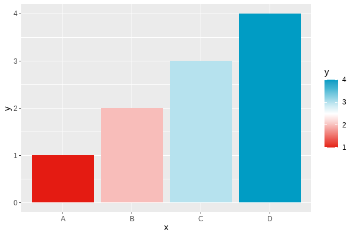
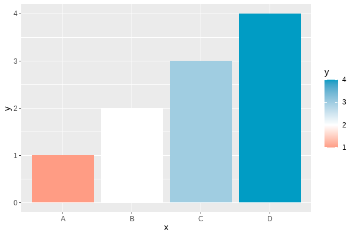
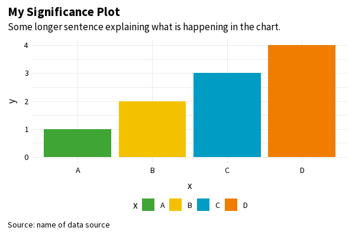

R package for styling graphics for RSS publications.

The package is currently available on [GitHub](https://github.com/nrennie/RSSthemes) and you can install it with:

```r
remotes::install_github("nrennie/RSSthemes")
```

You can then load the package using:

```r
library(RSSthemes)
```

# Colour palettes

There are currently three palettes available in {RSSthemes}, although we hope to add more in the future. 

## Using palettes with {ggplot2}

Let’s set up a basic data set.

```r
library(ggplot2)
plot_df <- data.frame(x = LETTERS[1:4],
                      y = 1:4)
```

### Single colour charts

If all of the bars, lines, points, etc. should have the same colour, you can set either the `fill` or `colour` arguments to have one of the RSS colours. The options are: `signif_red`, `signif_blue`, `signif_green`, `signif_orange`, or `signif_yellow`.

```r
ggplot(data = plot_df,
       mapping = aes(x = x, y = y)) +
  geom_col(fill = signif_yellow)
```



### Qualitative palettes

For working with qualitative (discrete) data, the best palette to use is `"signif_qual"`. This palette currently only contains four colours.

#### Discrete (fill) scale: `scale_fill_rss_d()`

```r
ggplot(data = plot_df,
       mapping = aes(x = x, y = y, fill = x)) +
  geom_col() +
  scale_fill_rss_d(palette = "signif_qual")
```



#### Discrete (colour) scale: `scale_colour_rss_d()`

```r
ggplot(data = plot_df,
       mapping = aes(x = x, y = y, colour = x)) +
  geom_point(size = 4) +
  scale_colour_rss_d(palette = "signif_qual")
```



### Sequential palettes

For working with sequential (continuous) data, the best palette to use is `"signif_seq"`.

#### Continuous (fill) scale: `scale_fill_rss_c()`

```r
ggplot(data = plot_df,
       mapping = aes(x = x, y = y, fill = y)) +
  geom_col() +
  scale_fill_rss_c(palette = "signif_seq")
```



#### Continuous (colour) scale: `scale_colour_rss_c()`

```r
ggplot(data = plot_df,
       mapping = aes(x = x, y = y, colour = y)) +
  geom_point(size = 4) +
  scale_colour_rss_c(palette = "signif_seq")
```



### Diverging palettes

For working with diverging (continuous) data, the best palette to use is `"signif_div"`.

#### Continuous (fill) scale: `scale_fill_rss_c()`

```r
ggplot(data = plot_df,
       mapping = aes(x = x, y = y, fill = y)) +
  geom_col() +
  scale_fill_rss_c(palette = "signif_div")
```



If you want to centre the diverging scale around a different value, you can alternatively pass the pre-defined colours into `scale_fill_gradient2()` from {ggplot2}:

```r
ggplot(data = plot_df,
       mapping = aes(x = x, y = y, fill = y)) +
  geom_col() +
  scale_fill_gradient2(low = signif_red, high = signif_blue, midpoint = 2)
```



# Theme functions

Theme functions style the non-data elements of plots, e.g. fonts, text colour, or background colour.

## Using themes with {ggplot2}

Apply styling to plots made with {ggplot2} using the `theme_significance()`
function:

```r
ggplot(data = plot_df,
       mapping = aes(x = x, y = y, fill = x)) +
  geom_col() +
  labs(title = "My Significance Plot",
       subtitle = "Some longer sentence explaining what is happening in the chart.",
       caption = "Source: name of data source") +
  scale_fill_rss_d(palette = "signif_qual") +
  theme_significance()
```


